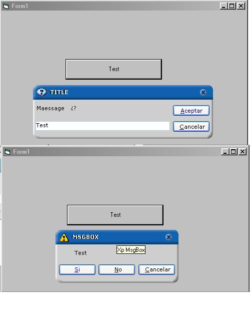



## XPInputMsg

### Description

MsgBox and InputBox con un stilo XP y algunos opciones mas, como ponerle colores al texto o agragarle un icono, etc.
 
### More Info
 

             |
---                |---
**Submitted On**   |2004-09-16 02:51:42
**By**             |[DamonG](https://github.com/Planet-Source-Code/PSCIndex/blob/master/ByAuthor/damong.md)
**Level**          |Intermediate
**User Rating**    |5.0 (10 globes from 2 users)
**Compatibility**  |VB 6\.0
**Category**       |[Custom Controls/ Forms/  Menus](https://github.com/Planet-Source-Code/PSCIndex/blob/master/ByCategory/custom-controls-forms-menus__1-4.md)
**World**          |[Visual Basic](https://github.com/Planet-Source-Code/PSCIndex/blob/master/ByWorld/visual-basic.md)
**Archive File**   |[XPInputMsg1794599162004\.zip](https://github.com/Planet-Source-Code/damong-xpinputmsg__1-56216/archive/master.zip)

